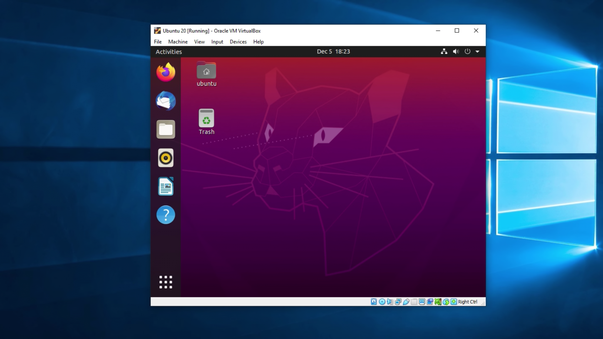
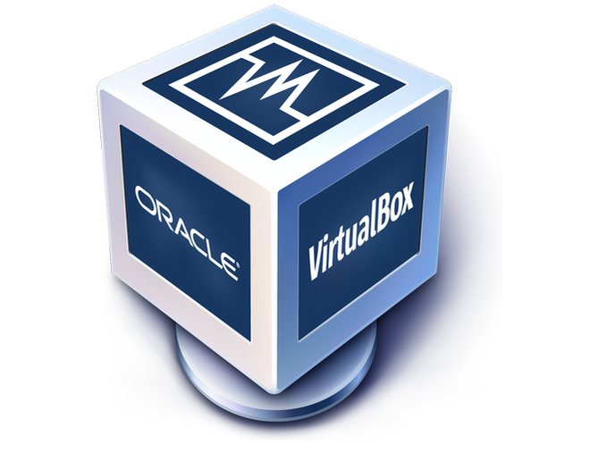
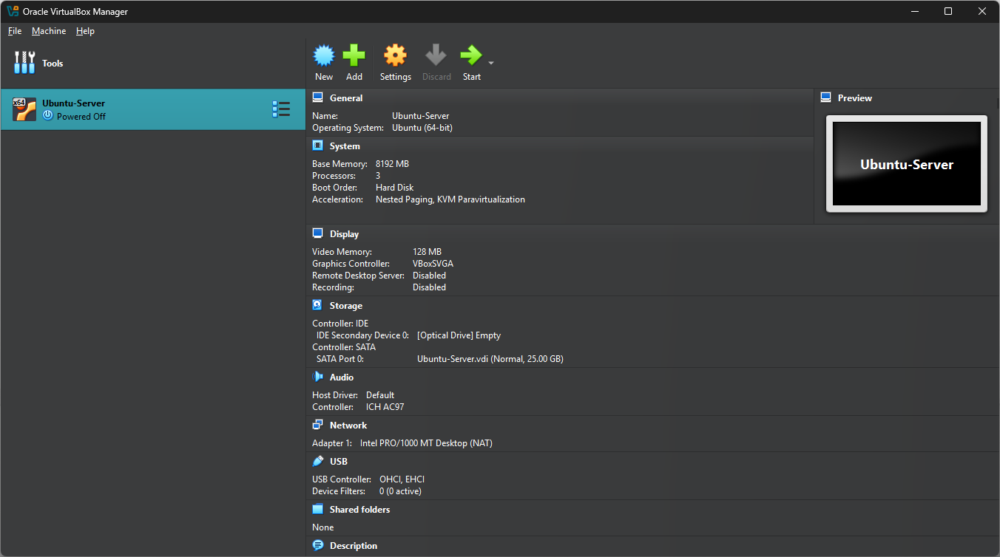

## **Development in Linux**

- Presented by:
  - SUIRITA Fahd
  - CHABBEH Aymen
  - Ayouby Amazu
- Framed by:
  - ESSARRAJ Fouad

---

### **1. Introduction to Linux:**

---

### **2. Why Use Linux for Development?**

- _Open-source_
- _Stability and security_
- _Powerful command-line tools_
- _Community support_

---

### **3. Linux Distributions (Distros):**

---

### **4. What is a Virtual Machine?**

---

### **5. Installing VirtualBox:**

---

### **6. Creating a Virtual Machine:**

---

### **7. Basic Linux Commands**

---

## **Summary & Q&A**

- Recap of **Linux basics**
- Installing & configuring Nginx
- Setting up a virtual machine
- Open floor for questions
